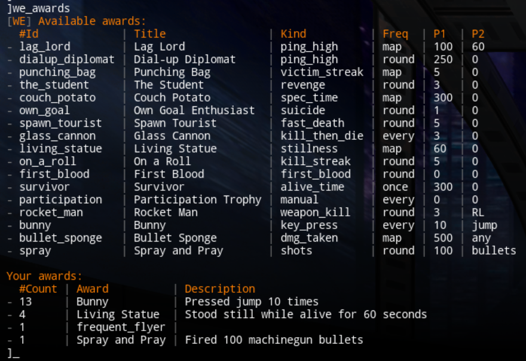
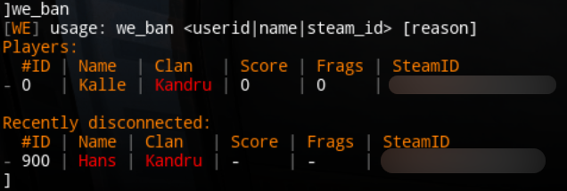
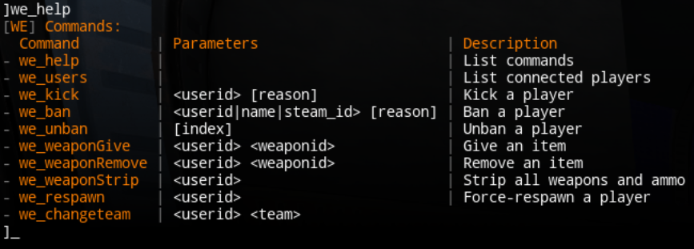
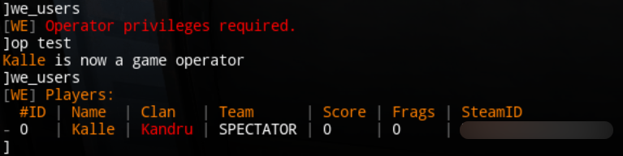
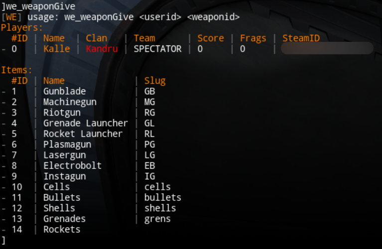
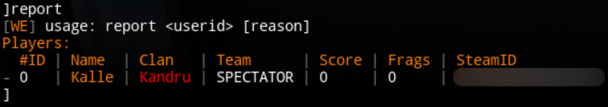

# warfork-extended

Modular operator framework for [Warfork](https://warfork.com) gameservers. It wraps stock (and your custom) gametype scripts at **build time** to allow additional features to be added. The build produces a pk3 with `we_`-prefixed default gametype files (no collision with stock pk3 paths).

## What it does

- Injects hooks around engine `GT_*` callbacks
- Stores data in `basewf/warfork-extended/*`
- SteamID-based player identity
- Operators via engine `op <password>` **or** SteamIDs in `we_operators` (always on when `we_enabled` is 1)
- Operator tools: kick, ban/unban, give/remove/strip weapons, respawn, change team
- Player reports (`we_report` / `report` → `report.txt`)
- Join tip in chat pointing players at `we_help` (`we_feature_welcome`)
- Operator join announce (`we_feature_opannounce`)
- Scoreboard clan override (`we_feature_clan`)
- Nick-change spam auto-ban (`we_feature_nickban`)
- Custom awards (`award_*` counters with every/map/round/once frequency, `we_awards` / `we_awardGive` / `we_awardRemove`)
- Per-player key/value files with userinfo snapshot + `last_connected` / `last_disconnected`

## Operators

A client is an operator if **either**:

1. They authenticated with the engine `op <password>` command (`client.isOperator`), or
2. Their SteamID64 is listed in `we_operators` (comma-separated; spaces/tabs OK)

Listed SteamIDs get `client.isOperator` set on join / userinfo change so custom gametypes that still check the engine flag keep working. Prefer `WE_IsOperator` / `WE_RequireOperator` in new code (see [development.md](development.md)).

## Commands

| Command | Permission | Description |
|---------|------------|-------------|
| `we_help` | everyone | List commands |
| `we_awards` | everyone | List your earned awards |
| `we_report` / `report` `<userid> <reason>` | everyone | File a player report (writes `report.txt`; announces in chat). On death, victims see a hint to report the killer. |
| `we_users` | operator | List connected players + steam_id |
| `we_kick <userid> [reason]` | operator | Kick a player (list if no arg) |
| `we_ban <userid|name|steam_id> [reason]` | operator | Ban player (list if no arg) |
| `we_unban [index]` | operator | Unban player (list if no arg) |
| `we_weaponGive <userid> <weaponid>` | operator | Give an item (id or unique name fragment) |
| `we_weaponRemove <userid> <weaponid>` | operator | Remove an item (id or unique name fragment) |
| `we_weaponStrip <userid>` | operator | Remove all weapons and ammo |
| `we_respawn <userid>` | operator | Force-respawn a player (list if no arg) |
| `we_changeteam <userid> <team>` | operator | Move player to a team (id or name fragment) |
| `we_awardGive <userid> <award_id>` | operator | Grant a catalog award |
| `we_awardRemove <userid> <award_id>` | operator | Remove one count of a catalog award |

- `reason` is required for `we_report` / `report` (at least 3 characters); optional for kick/ban
- `userid` is a player slot or a unique case-insensitive name fragment (`WE_ClientFromArg` / `WE_FindClient` in `src/we/utils/clients.as`)
- `we_ban` with no/unknown arg lists online players and up to 25 recently disconnected users (IDs **900+**). Targets: player slot, recent id (`900`…), unique name fragment (online or recently disconnected), or unique steam_id fragment; a full steam_id still works for anyone with a user file
- `weaponid` is an item tag, or a unique fragment of the item name / short name
- `team` is a team id (`0`–`3`), or a unique fragment of the team name / defaultName (e.g. `spec`)
- Console chrome colors: `basewf/warfork-extended/theme.txt` (see [`configs/theme.txt.example`](configs/theme.txt.example); seeded on first run)

## Optional features

| Cvar | Default | Behavior |
|------|---------|----------|
| `we_feature_opannounce` | `1` | On join, broadcast `[WE] <name> is an operator` for operators |
| `we_feature_clan` | `0` | Rewrite scoreboard clan column (see clan cvars below) |
| `we_feature_nickban` | `0` | Warn, then ban+kick players who change name too often while playing (`name change spam`) |
| `we_feature_welcome` | `1` | Chat tip pointing new players at `we_help` |
| `we_feature_ban` / `weapon` / `respawn` / `changeteam` / `awards` / `report` | `1` | Gate the matching command groups |

### Clan override (`we_feature_clan 1`)

| Who | Scoreboard clan |
|-----|-----------------|
| Operator (`op` or `we_operators`) | `we_clan_tag` (if non-empty; may include `^` color codes) |
| Non-op whose clan matches `we_clan_reserved` (color-stripped, case-insensitive) | `-` |
| Everyone else | real clan, or `-` if empty |

`we_clan_tag` is a single scoreboard token (spaces stripped). Put colors in the tag itself (e.g. `^1Kandru`).

## Requirements

- Linux
- `python3`, `zip`, `make` (and `mv`/`cp` via coreutils)
- `docker` (only for `make go` / `make go-release` / `make go-install`; container runs as your UID/GID). Host `go` 1.22+: `GO_DOCKER=0`

## Build

```bash
# optional: copy config for make dev install path
cp config.mk.example config.mk
# edit WARFORK_BASEWF=/path/to/basewf

make          # help
make prod     # dist/prod/gt_warfork_extended_<VERSION>.pk3 (stock GTs + WE only)
make dev      # debug inject + copy pk3 into WARFORK_BASEWF
make go       # dist/go/we-report-notify via Docker Go (GO_DOCKER=0 for host go)
make go-install  # install binary + example config to /opt/we-report-notify
```

Drop the pk3 into your server `basewf` folder (remove older `gt_warfork_extended_*.pk3` first if not using `make dev`).

### Custom gametypes (separate pk3)

Custom GTs live in **their own repos** and ship as a **thin pk3** that still needs this WE pk3 on the server (AngelScript includes resolve via the VFS). Build from this repo:

```bash
make custom CUSTOM_ROOT=/path/to/my-gt-repo PK3=/path/to/gt_mygt.pk3
# optional: MODE=debug
```

`CUSTOM_ROOT` must contain `progs/gametypes/<name>.gt` (+ `.as` extras). Filenames stay unprefixed. Put both pk3s in `basewf`.

Custom GT repos (e.g. agungame) should run `make dev` only for their thin pk3. Install `gt_warfork_extended_*.pk3` via `make dev` in this repo — do not rely on a vendored copy of warfork-extended to deploy WE.

Rebuild the custom pk3 when you bump WE if inject hooks / include order / `we/` paths change. Feature-only WE updates that keep the same paths usually do not need a custom rebuild. After WE adds new wrapper dispatches (e.g. `GT_ScoreboardMessage` after-hooks), rebuild custom thin pk3s.

Local one-pk3 debug (overlay into the WE zip): `make prod INCLUDE_CUSTOM=1` (uses `gamemodes/custom/`, or `CUSTOM_ROOT=…`).

## Server config

Paste cvars into your `server.cfg` (full annotated copy: [`configs/warfork-extended.cfg.example`](configs/warfork-extended.cfg.example)). Warfork-Extended does not write a config file itself.

| Cvar | Default | Notes |
|------|---------|-------|
| `we_enabled` | `1` | Master switch |
| `we_debug` | `0` | Extra `G_Print` on most `GT_*` wrappers (not `GT_ThinkRules`) |
| `we_operators` | `""` | Comma-separated SteamID64 ops (always on with `we_enabled`) |
| `we_feature_*` | see table above | Feature toggles |
| `we_clan_tag` | `""` | Scoreboard tag for operators when clan feature is on (`^` colors allowed) |
| `we_clan_reserved` | `""` | Tag non-ops may not display |
| `we_awards_center_message` / `we_awards_chat_message` | `1` | Award announcement channels |

Example (clan + nickban left off until configured):

```
set we_enabled "1"
set we_debug "0"
set we_operators "0000000,111111,22222"
set we_feature_ban "1"
set we_feature_weapon "1"
set we_feature_respawn "1"
set we_feature_changeteam "1"
set we_feature_awards "1"
set we_awards_center_message "1"
set we_awards_chat_message "1"
set we_feature_report "1"
set we_feature_welcome "1"
set we_feature_opannounce "1"
set we_feature_clan "0"
set we_clan_tag "^1Kandru"
set we_clan_reserved "kandru"
set we_feature_nickban "0"
```

## Report webhooks

Optional sidecar [`tools/report-notify/`](tools/report-notify/) watches one or more `report.txt` files and posts Discord webhook embeds when players file reports. It is **not** inside the pk3; run it on the host (or any machine that can read the report files).

### Config

Copy [`tools/report-notify/config.yaml.example`](tools/report-notify/config.yaml.example) to `config.yaml` next to the binary (or pass `-config`). List `report.txt` paths; set a global webhook list and/or per-server webhooks. Discord uses `sv_hostname` from each report line (no display name in config):

```yaml
webhooks:
  - "https://discord.com/api/webhooks/ID/TOKEN"

poll_interval: 1m

servers:
  - path: /path/to/basewf/warfork-extended/report.txt
  - path: /path/to/other/basewf/warfork-extended/report.txt
    webhooks:
      - "https://discord.com/api/webhooks/OTHER/TOKEN"
```

If a server has its own `webhooks` list, that list is used instead of the global one. After every line in a file is posted, that `report.txt` is truncated. A report appended by the game during the truncate can be lost; that is accepted.

### Install (cron)

One-shot mode (`-cron`) reads the files, posts, truncates, and exits. It does not watch for changes.

```bash
make go-install                    # PREFIX=/opt/we-report-notify
sudo $EDITOR /opt/we-report-notify/config.yaml
sudo crontab -e                    # paste tools/report-notify/crontab.example
```

```
* * * * * /opt/we-report-notify/we-report-notify -cron
```

(`-once` is an alias for `-cron`.)

### Install (systemd)

Long-running watcher (fsnotify with poll fallback). Restarts automatically if the process exits with an error:

```bash
make go-install
sudo $EDITOR /opt/we-report-notify/config.yaml
sudo cp tools/report-notify/we-report-notify.service.example /etc/systemd/system/we-report-notify.service
sudo systemctl daemon-reload
sudo systemctl enable --now we-report-notify.service
journalctl -u we-report-notify -f
```

Sent reports are printed to stdout, for example:

```
sent EU DM | Alice [TAG] reported Bob [CLAN] | 7656119… -> 7656119… | score=10 frags=8 deaths=3 suicides=1 | wallhacks
```

GitHub Releases also ship `we-report-notify-linux-amd64` next to the pk3. Update an installed binary in place:

```bash
/opt/we-report-notify/we-report-notify self-update
# systemd watcher: systemctl restart we-report-notify
```

Cron (`-cron`) picks up the new binary on the next run; a long-running systemd unit keeps the old inode until restarted.

## Extending (features)

Add AngelScript under `src/we/features/<name>/`, then register in that feature's `*_Register()`:

```
WE_Hooks_AddThinkAfter( @My_Think );
WE_Cmds_Add( "we_foo", "<userid>", "Do the foo", true, @My_Cmd );
```

Call your `*_Register()` from `WE_Init()` in `src/we/core/main.as`. Hook API uses AngelScript `funcdef` handles (`core/hook_types.as`).

Custom gamemodes: persistent player data via `WE_GetPlayerData` / `WE_SetPlayerData` (keys stored as `cust_*`) — see [development.md](development.md).

1. In a **separate** repo, use the stock layout: `progs/gametypes/<name>.gt` + `.as` extras
2. Add this repo as a submodule (or CI checkout), then:
   `make -C path/to/warfork-extended custom CUSTOM_ROOT=$PWD PK3=$PWD/dist/gt_<name>.pk3`
3. Install **both** `gt_warfork_extended_*.pk3` and your custom pk3 into `basewf`, then restart

## Version / releases

- Bump [`VERSION`](VERSION) (semver).
- Pushing a change to `VERSION` on `main` runs GitHub Actions: build prod pk3 + Linux `we-report-notify` binary, then a GitHub Release with both assets and commits since the previous tag.

## Screenshots

### Command we_awards



### Command we_ban



### Command we_help



### Command we_users



### Command we_weapon*



### Command report



## License

See [LICENSE](LICENSE).
