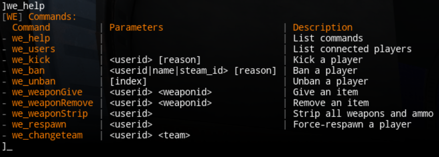
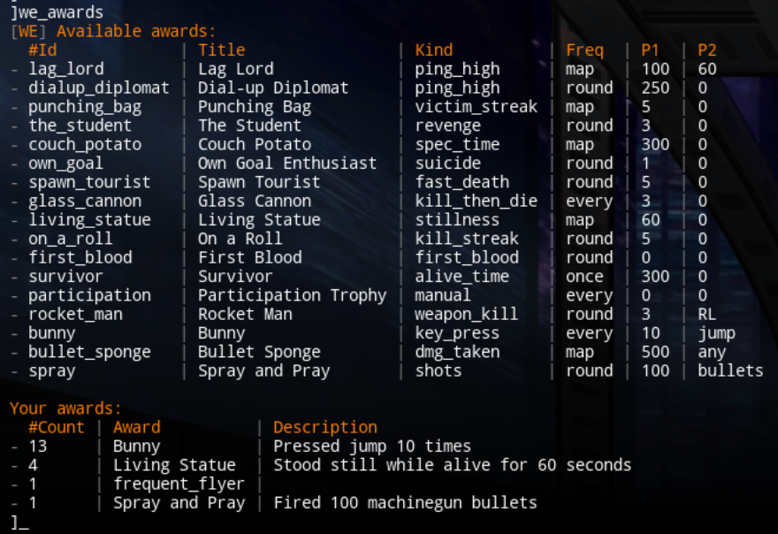
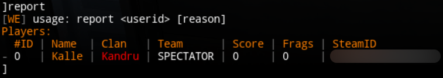
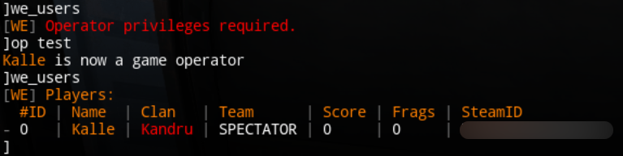
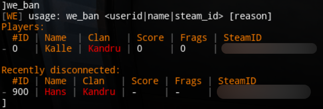
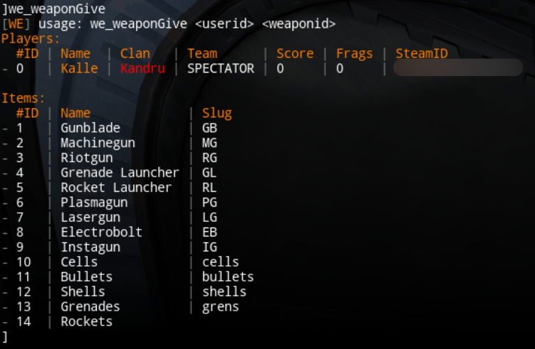

# Warfork Extended

Extra tools for a [Warfork](https://warfork.com) gameserver: admin commands, awards, and player reports.

[Releases](https://github.com/derkalle4/warfork-extended/releases) · [License](LICENSE)

## What it is

Warfork Extended adds server tools on top of the stock game modes. The server can kick and ban by Steam account, give awards, take player reports, show an admin clan tag on the scoreboard, pick a random map when the process starts, and ban players.

## Features

| Feature | Default | What it does |
|---------|---------|--------------|
| Admin Commands | - | kick, ban, respawn, change team, set weapons, ... for server admins |
| Awards | on | Track custom awards and show them in chat / center print |
| Player reports | on | Players file reports; server stores them and announces in chat - an additional tool can send them to Discord |
| Operator announcent | on | Chat line when an operator joins |
| Random start map | on | Once per server process, load a random installed map |
| Scoreboard clan tag | off | Operators get a fixed clan tag; reserved tag is disallowed for others |
| Name-change ban | off | Warn, then ban players who change name too often while playing |

Additionally all admin commands include an historic list of all players (even when they left) so admins can take action even though they're offline.

## Installation

1. Download `gt_warfork_extended_<version>.pk3` from the [latest release](https://github.com/derkalle4/warfork-extended/releases).
2. Put it in the server `basewf` folder.
3. Delete any older `gt_warfork_extended_*.pk3` in that folder.
4. In the config that runs when the server is being started (e.g. `server.cfg`), set the gametype to a `we_` name. The pk3 does not replace stock names like `dm` or `bomb`; it adds:

   `we_dm`, `we_duel`, `we_ffa`, `we_tdm`, `we_ca`, `we_bomb`, `we_ctf`, `we_ctftactics`, `we_headhunt`, `we_race`, `we_da`, `we_rekt`, `we_tutorial`, ...

   Example: `set g_gametype "we_bomb"`
5. Paste the required settings from [Configuration](#configuration) into that same config.
6. Restart the server.

If you also run a custom gametype pk3 built for this project, put that file in `basewf` too. How to build it is in [development.md](development.md).

## Players

Open the console and type the command. `we_help` lists every command available.

| Command | What it does |
|---------|--------------|
| `we_help` | List commands |
| `we_awards` | List the award catalog and your counts |
| `we_report <userid> <reason>` | Report a player (alias: `report`) |

Report rules:

- Reason must be at least 3 characters
- You cannot report yourself
- Wait 60 seconds between reports
- The report is announced in chat







## Configuration

### Files the server writes

Created under `basewf/warfork-extended/` on first use. The server does not write your startup config.

| File | Purpose |
|------|---------|
| `banlist.txt` | Saved bans |
| `report.txt` | Saved player reports |
| `awards.txt` | Award catalog; written with defaults if missing |
| `theme.txt` | Console colors; written with defaults if missing |
| `users/<SteamID>.txt` | data saved about a player |
| `recent_disconnects.txt` | Last 25 SteamIDs (used when banning someone who just left) |

### Startup config (`server.cfg`)

Paste the lines below into the config the server runs at startup. That file is often named `server.cfg`; it may have another name on your host. Do not `exec` a second file from the gametype.

Full annotated copy: [`configs/warfork-extended.cfg.example`](configs/warfork-extended.cfg.example).

Settings that are not a feature:

| Cvar | Default | What it does |
|------|---------|--------------|
| `we_enabled` | `1` | Commands run. Set `0` to turn commands off. Feature hooks use `we_feature_*` |
| `we_debug` | `0` | Extra server console prints. Leave off |
| `we_operators` | `""` | Comma-separated 17-digit SteamIDs. Same rights as `op <password>`. Spaces are fine |

Example (replace the SteamID with yours):

```
set we_enabled "1"
set we_debug "0"
set we_operators "76561198000000000,76561198000000000,76561198000000000"
set we_feature_ban "1"
set we_feature_weapon "1"
set we_feature_respawn "1"
set we_feature_changeteam "1"
set we_feature_awards "1"
set we_awards_center_message "1"
set we_awards_chat_message "1"
set we_feature_report "1"
set we_feature_welcome "1"
set we_feature_opannounce "1"
set we_feature_startmap "1"
set we_startmap_list ""
set we_feature_clan "0"
set we_clan_tag ""
set we_clan_reserved ""
set we_feature_nickban "0"
```

### Bans

Bans kick the player when they join.

- `we_feature_ban` — default `1`
- `we_kick` still works when this is `0`

### Weapons

Give, take, or strip weapons and ammo.

- `we_feature_weapon` — default `1`

### Respawn

Force-respawn a player who is in the match. Spectators cannot be respawned.

- `we_feature_respawn` — default `1`

### Team change

Move a player to another team. Team is a number `0`–`3` or a unique part of the team name (for example `spec`).

- `we_feature_changeteam` — default `1`

### Awards

Track custom awards. Counts are kept on the player file.

- `we_feature_awards` — default `1`
- `we_awards_center_message` — default `1` (center print)
- `we_awards_chat_message` — default `1` (chat)

Catalog file: `basewf/warfork-extended/awards.txt` (max 32 awards). Loaded on map change. Line shape:

```
id|enabled|kind|freq|p1|p2|title|description
```

Frequency: `every`, `map`, `round` (once per match, not a bomb/CA round), or `once`. Full kinds and filters: [awards.md](awards.md). Example catalog: [`configs/awards.txt.example`](configs/awards.txt.example).

### Reports

Players file reports. Each report is appended to `report.txt`.

- `we_feature_report` — default `1`

Optional Discord watcher: [`tools/report-notify/`](tools/report-notify/). It is not inside the pk3. Releases also ship `we-report-notify-linux-amd64`.

Copy [`tools/report-notify/config.yaml.example`](tools/report-notify/config.yaml.example) to `config.yaml` next to the binary (or pass `-config`):

```yaml
webhooks:
  - "https://discord.com/api/webhooks/ID/TOKEN"

poll_interval: 1m

servers:
  - path: /path/to/basewf/warfork-extended/report.txt
  - path: /path/to/other/basewf/warfork-extended/report.txt
    webhooks:
      - "https://discord.com/api/webhooks/OTHER/TOKEN"
```

A per-server `webhooks` list replaces the global list for that file. After every line in a file is posted, that `report.txt` is truncated. A report written during the truncate can be lost.

**Cron** (one-shot each minute):

```bash
make go-install
sudo $EDITOR /opt/we-report-notify/config.yaml
sudo crontab -e   # paste tools/report-notify/crontab.example
```

```
* * * * * /opt/we-report-notify/we-report-notify -cron
```

**systemd** (long-running watcher):

```bash
make go-install
sudo $EDITOR /opt/we-report-notify/config.yaml
sudo cp tools/report-notify/we-report-notify.service.example /etc/systemd/system/we-report-notify.service
sudo systemctl daemon-reload
sudo systemctl enable --now we-report-notify.service
```

Update an installed binary:

```bash
/opt/we-report-notify/we-report-notify self-update
# systemd: systemctl restart we-report-notify
```

Cron picks up the new binary on the next run. A systemd unit keeps the old binary until restarted.

### Welcome

On join, chat tells the player to type `we_help`. Needs a SteamID.

- `we_feature_welcome` — default `1`

### Operator announce

When an operator joins, chat shows `[WE] <name> is an operator`.

- `we_feature_opannounce` — default `1`

### Start map

Once per server process, load one random installed map.

- `we_feature_startmap` — default `1`
- `we_startmap_list` — default `""`. Empty means use `g_maplist`. A non-empty list is space-separated map names and is used instead of `g_maplist` for that one pick.

Maps that are not installed are skipped. If the pick is already loaded, the map stays.

### Clan tag

Rewrite the scoreboard clan column.

- `we_feature_clan` — default `0`
- `we_clan_tag` — tag for operators (one word; spaces removed; `^` color codes kept, for example `^1Kandru`)
- `we_clan_reserved` — tag non-operators are not allowed to have (colors ignored, case ignored)

| Who | Scoreboard clan |
|-----|-----------------|
| Operator | `we_clan_tag` if set |
| Non-operator whose clan matches `we_clan_reserved` | `-` |
| Everyone else | their clan, or `-` if empty |

### Name-change ban

While spawned and not spectating, a name change warns, the next warns again, the third bans and kicks with reason `name change spam`. Checked about every 11 seconds. Strikes clear when the name stays the same or the player goes to spectator. Operators and players without a SteamID are ignored.

- `we_feature_nickban` — default `0`

### Console colors

Edit `basewf/warfork-extended/theme.txt`. Roles: `accent`, `header`, `sep`, `marker`, `body`, `success`, `error`, `warn`. Colors: `black`, `red`, `green`, `yellow`, `blue`, `cyan`, `purple`, `white`, `orange`, `gray`. Defaults: [`configs/theme.txt.example`](configs/theme.txt.example).

## Administration

An operator used `op <password>` or is listed in `we_operators`. Other players get “Operator privileges required.” You cannot kick, ban, or report yourself.

Shared rules:

- Type the command in the console.
- `userid` is the player slot or a unique part of the name (case does not matter). If several names match, the server lists them and does nothing.
- A missing or unknown target prints usage and a player list.
- Kick and ban lists omit the team column. Other player lists include it.
- `we_ban` with no match also lists up to 25 people who just left, numbered from 900. You can ban a slot, a 900+ id, a unique name, a unique SteamID fragment, or a full SteamID of someone who already has a user file.
- Kick and ban reasons are optional. Empty becomes `no reason given`.
- `weaponid` is an item number or a unique part of the item name. A bad or missing item prints the item list.
- `award_id` is the id from `awards.txt` (also shown by `we_awards`).

### we_users

List connected players, SteamID, and team. Always available when commands are on.



### we_kick

```
we_kick <userid> [reason]
```

Kick a player now. Not saved. Works with bans off (`we_feature_ban 0`). The target sees the reason.

### we_ban

```
we_ban <userid|name|steam_id> [reason]
```

Save the ban, kick if they are online, block them on later joins. Needs a SteamID. List is full at 256. Off with `we_feature_ban 0`.

No argument (or unknown target) lists online players and recent disconnects.



### we_unban

```
we_unban [index]
```

No index prints the ban list with indexes. An index removes that row. Off with `we_feature_ban 0`.

### we_weaponGive

```
we_weaponGive <userid> <weaponid>
```

Give the item, ammo, and select it if it is a weapon. Off with `we_feature_weapon 0`.



### we_weaponRemove

```
we_weaponRemove <userid> <weaponid>
```

Set that item count to 0. Off with `we_feature_weapon 0`.

### we_weaponStrip

```
we_weaponStrip <userid>
```

Take all weapons and their ammo. Off with `we_feature_weapon 0`.

### we_respawn

```
we_respawn <userid>
```

Respawn the player. The target is told. Fails for spectators. Off with `we_feature_respawn 0`.

### we_changeteam

```
we_changeteam <userid> <team>
```

Move the player to a team and respawn them there. The target is told. Already on that team does nothing. A team the mode does not allow fails. A bad team name prints the team list. Off with `we_feature_changeteam 0`.

### we_awardGive

```
we_awardGive <userid> <award_id>
```

Add one to that award and show the normal award messages. Ignores how often the award would grant itself. Off with `we_feature_awards 0`.

### we_awardRemove

```
we_awardRemove <userid> <award_id>
```

Subtract one award count. If the count is already 0, the server says so. Off with `we_feature_awards 0`.

## Build it yourself

On Linux you need `make`, `zip`, and `docker`. Then:

```bash
make prod
```

Output: `dist/prod/gt_warfork_extended_<version>.pk3`.

Custom gametypes, hooks, and APIs: [development.md](development.md). Contributing: [CONTRIBUTING.md](CONTRIBUTING.md).

## License

See [LICENSE](LICENSE).
